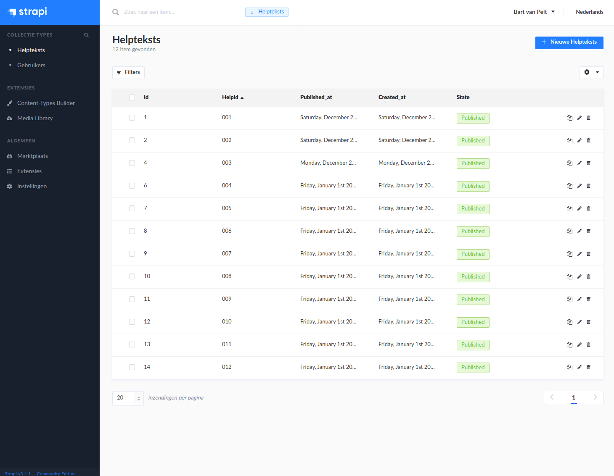

# Using fonts

See  
- https://fontawesome.com/ for a description
- https://fontawesome.com/icons for a list of known icons
- https://github.com/FortAwesome/angular-fontawesome for description of installation
- https://openbase.io/ description of opensource software

# My installation

From the compatibility guide angular 11.x uses @fortawesome/angular-fontawesome version 0.8.x

```bash
$ ng add @fortawesome/angular-fontawesome@0.8.1
```

# Rich text editor 
See
- rich text editor https://ej2.syncfusion.com/angular/documentation/rich-text-editor/getting-started/ 
- alternatives https://angularscript.com/best-wysiwyg-editors/ 
- inline html https://blog.fullstacktraining.com/binding-html-with-angular/ 

# Setup data
Use the admin userinterface of the strapi backend (http://localhost:1337/admin to fill the database with initial data

## Define content type Helptekst with the fields
- helpid - unique string identification
- helptekst - a richtext field
  


## Add content
Add a number of entries to see data.
In order to get helptexts use
- helpid: '001', '002' en '003'
  
and add some text for these entries



## Add authentication
### Public access
In order to make it possible for everyone to see the information add read access to the public profile for Helptekst.

This applies to the http get requests


### Authenticated access

Add a role Author with all access on helptekst.


Add a user testauthor with role Author


# Nginix
See https://phoenixnap.com/kb/how-to-install-nginx-on-ubuntu-20-04 for configuration on linux

Configuration in /etc/nginx/sites-available/test_domain.com

Documentation on configuration https://docs.nginx.com/nginx/admin-guide/monitoring/logging/

Configuring CORS on nginx https://enable-cors.org/server_nginx.html 

# Deployment
See https://angular.io/guide/build for building aspects

Sess https://stackoverflow.com/questions/8305015/when-using-proxy-pass-can-etc-hosts-be-used-to-resolve-domain-names-instead-of 


